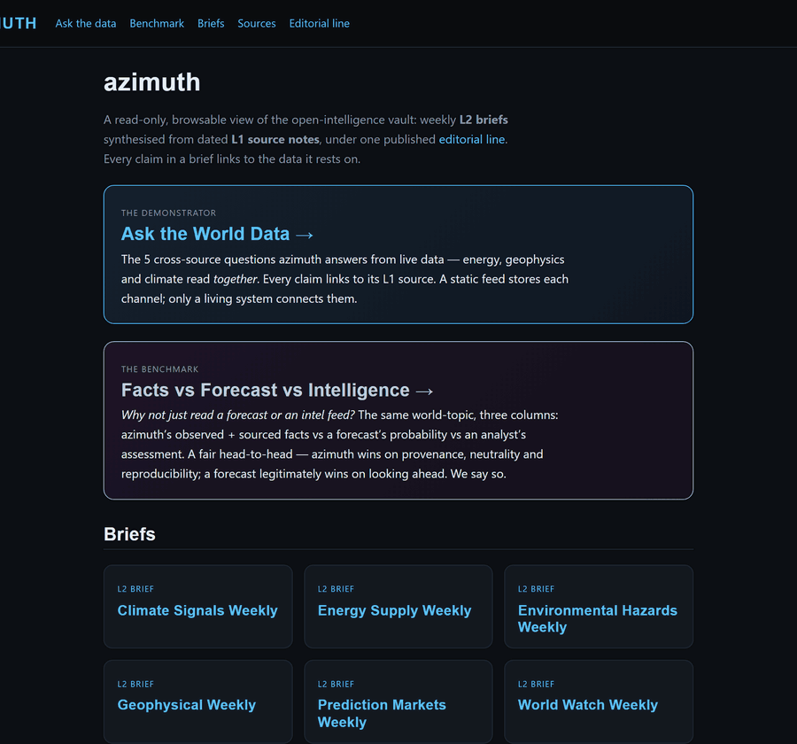
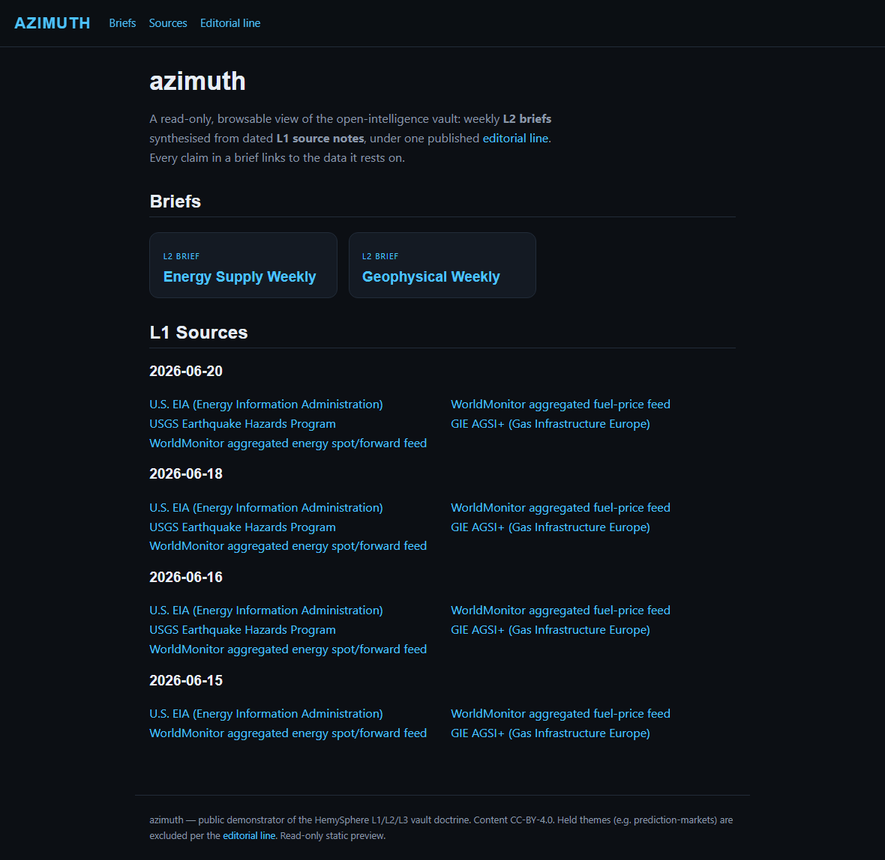
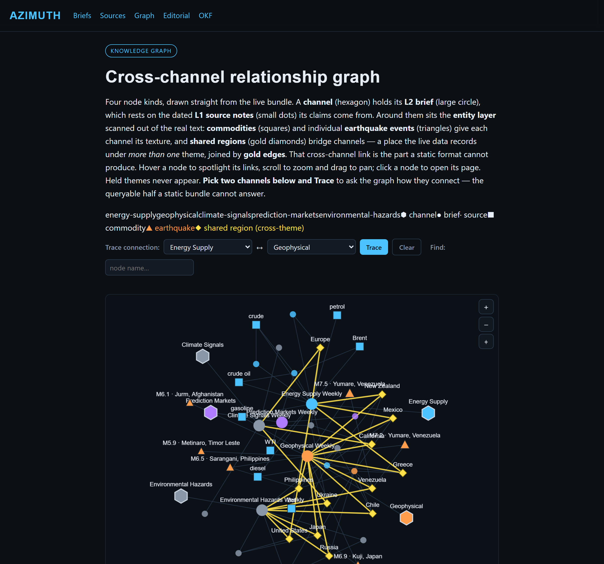

# azimuth

[](https://github.com/mickywin22/azimuth/actions/workflows/ci.yml)
[](https://github.com/mickywin22/azimuth/actions/workflows/ingest.yml)
[](https://github.com/mickywin22/azimuth/actions/workflows/synthesis-freshness.yml)
[](LICENSE)
[](LICENSE-CONTENT.md)
[](https://mickywin22.github.io/azimuth/autonomy.html)
[](https://mickywin22.github.io/azimuth/autonomy.html)
[](https://mickywin22.github.io/azimuth/autonomy.html)

Public demonstrator of the HemySphere L1/L2/L3 vault doctrine, fed by Worldmonitor open-intelligence data.

> **Status — engine live, awaiting public flip.** The pipeline runs end-to-end: a daily
> GitHub Actions job pulls the WorldMonitor subsets into dated **L1 source notes**, a weekly
> synthesis cycle evolves the per-theme **L2 briefs**, and a small **L3 rule set** (editorial
> line, attribution, source guardrail) governs both — all enforced by CI. The runtime is
> **pure standard-library Python** (no web server, no third-party runtime deps). The concept,
> data-source feasibility, and build plan are written up in [docs/spec.md](docs/spec.md),
> [docs/plan.md](docs/plan.md), and [docs/architecture.md](docs/architecture.md).



> This hero is **built deterministically from the committed page previews** — no browser,
> pure Pillow — so it rebuilds byte-for-byte like every other azimuth artifact:
> `python scripts/build_hero_gif.py` (guard with `--check`). A live browser-recorded
> variant is available via `scripts/record_hero_gif.py` (`[demo]` extras), but it is not
> required and does not produce the committed asset.

<details>
<summary>Static stills (the individual scenes)</summary>





</details>

## What it is

A public, read-only knowledge vault that applies the HemySphere **L1 sources → L2 synthesis → L3 rules** wiki pattern to open global-intelligence data sourced from the [Worldmonitor](https://worldmonitor.app) public API. It proves the doctrine bundle in a live, non-personal domain — showing the architecture without exposing any private Emi vault content.

## Quick Start

```bash
# Clone
git clone https://github.com/mickywin22/azimuth.git
cd azimuth

# Install dev tooling (pure-stdlib runtime — no server, no third-party deps)
uv pip install -e ".[dev]"

# Run the L1 ingest (pulls WorldMonitor subsets -> dated L1 notes)
python scripts/run_ingest.py
```

## Reproducibility challenge

> **Every derived artifact rebuilds byte-for-byte from the committed L1 sources** — a
> deterministic, wall-clock-independent build, no pre-built data, no secrets, no hidden
> state. CI proves it on every push; prove it yourself on any clone in three commands:

```bash
python scripts/build_graph.py --check         # knowledge graph is byte-identical
python scripts/build_brief_index.py --check    # brief index is byte-identical
python scripts/build_autonomy.py --check       # autonomy counters are byte-identical
```

Each exits `0` **only if** regenerating the artifact from the committed `vault/` reproduces
the checked-in file bit-for-bit — the same guarantee that lets a public reader trust the
numbers and the graph. Rendering the whole read-only site is deterministic too:
`python scripts/build_site.py` produces byte-identical output across runs from the same
`vault/`.

**Run the live engine yourself** (fresh data — this is the engine, not the reproducibility
proof): `python scripts/run_ingest.py` pulls a new L1 day from the free WorldMonitor API
(anonymous session, no key), and the weekly `azimuth-curator` role evolves the L2 brief
narrative from it. The deterministic artifacts above then re-derive from that new day.

## Development

```bash
# Run tests
pytest tests/ -v

# Lint + format
ruff check guardrail/ ingest/ tests/ --fix
ruff format guardrail/ ingest/ tests/

# Type check
mypy guardrail/ ingest/

# Pre-commit hooks
pre-commit install
```

## Public site & deploy

The browsable read-only site (weekly L2 briefs → L1 sources → L3 editorial line, plus the
cross-channel knowledge graph) builds with `python scripts/build_site.py` and is published
to **GitHub Pages** by [`.github/workflows/pages.yml`](.github/workflows/pages.yml) on every
push to `main`.

The knowledge graph is both **visual** (`site/graph.html` — pick any two channels and
**Trace** how they connect) and **queryable from the command line** via
[`scripts/query_graph.py`](scripts/query_graph.py) over the same `site/graph.json`:

```bash
python scripts/query_graph.py connect energy geophysical   # the cross-channel answer
python scripts/query_graph.py provenance "Greece"          # the L1 notes backing an entity
python scripts/query_graph.py path "Greece" "Energy Supply"
python scripts/query_graph.py bridges                       # all cross-channel bridges
python scripts/query_graph.py hubs --top 8 --json
```

Every edge is typed (`has-brief`, `rests-on`, `mentioned-in`, `named-in`, `reported-in`,
`located-in`). The graph reaches the **L1 sources, not just the briefs**: a `mentioned-in`
edge carries a `weight` (how many L1 notes name the entity) and that count is backed by one
`named-in` edge per actual source note — `provenance` re-expands it into the exact dated L1
notes, channel by channel.

Beyond link *topology*, the vault also lifts to a **typed RDF graph**. The `vault/` OKF-style
Markdown bundle plus one committed composed context ([`vault/context.jsonld`](vault/context.jsonld))
is already valid linked data — the **Vault-LD OKF compatibility profile** (SPEC Appendix B).
[`scripts/build_rdf.py`](scripts/build_rdf.py) exports `schema.ttl` (the ontology) + `data.ttl`
(every note as a typed subject) beside the site; `rdflib` is a **CI-only** dependency, so the
runtime stays pure standard library. Full write-up: [docs/linked-data.md](docs/linked-data.md).

> **Pages URL (once enabled): https://mickywin22.github.io/azimuth/**

The repo is **private** and the site is **not live** until GitHub Pages is explicitly
enabled in the repo settings — that flip is a deliberate manual step. Full build steps,
the ready-to-flip gate, and the local validation command are in
[docs/deploy.md](docs/deploy.md).

## Operations — engine liveness

The two-lane engine's health is observable, not assumed — each lane has its own scheduled
GitHub Actions heartbeat that raises a dedup'd tracking issue if it dies. The full on-call
runbook — every scheduled job, the alarm it raises, and the exact response when a badge goes
red — is in **[docs/operations.md](docs/operations.md)**.

**L1 ingest** ([`.github/workflows/ingest.yml`](.github/workflows/ingest.yml), daily) — the
engine every brief rests on:

- **In-workflow gate** — after each pull the run asserts the newest committed L1 day is
  within tolerance (`scripts/check_ingest_liveness.py --check`); a stale result fails the job.
- **Failure alarm** — a failed daily run opens (or appends to) a single `ingest-alarm`
  tracking issue, so the engine can never die silently.
- **Anywhere** — check liveness by hand:

```bash
python scripts/check_ingest_liveness.py            # alive / STALE, with the latest L1 day + age
python scripts/check_ingest_liveness.py --check    # exit 1 if the latest L1 day is stale
```

**L2 synthesis** ([`.github/workflows/synthesis-freshness.yml`](.github/workflows/synthesis-freshness.yml),
weekly) — unlike L1, the weekly brief is written by the fleet curator (an LLM job off
GitHub infra), so a power-off can't be assumed to keep it running. This workflow gives the
L2 lane the same visible heartbeat: every Monday it checks each clean-theme brief against
the latest L1 day and, if any is genuinely **overdue** (lagging by more than one weekly
cadence — the synthesis actually failed to run), opens a single `synthesis-alarm` issue.
Merely *stale* (awaiting the next scheduled curator pass) stays quiet.

```bash
python scripts/check_synthesis_freshness.py            # per-theme table: fresh / stale / OVERDUE
python scripts/check_synthesis_freshness.py --overdue  # exit 1 only if a brief genuinely failed to run
```

## Autonomy — proof it runs itself

The point of azimuth is not any single brief — it is that the whole pipeline *operates on
its own*: the daily ingest, the weekly synthesis, and the CI doctrine gates run hands-off,
for cents a week. That claim is surfaced as **hard, checkable counters** rather than a
marketing sentence — days operating, daily L1 ingests committed, L1 source notes written,
L2 briefs maintained, data channels surfaced, and an explicitly-labelled LLM-spend
estimate:

- **Live counters page:** [`site/autonomy.html`](site/autonomy.html) — machine-readable
  companion [`site/autonomy.json`](site/autonomy.json).
- Every counter is derived **purely from committed vault data, never the wall clock**, so
  it is byte-reproducible and CI-guarded (`build_autonomy.py --check`). The counters
  re-derive on each daily ingest — exactly like the knowledge graph and brief index — so
  they advance one day at a time and can never drift from the data.
- Spend is an honest **order-of-magnitude estimate** (weeks of operation × the small
  weekly synthesis cost), clearly marked as an estimate — not fake-precise metered billing.

```bash
python scripts/build_autonomy.py            # rebuild site/autonomy.json + autonomy.html
python scripts/build_autonomy.py --check    # exit 1 if the committed counters are stale
```

## Repository layout

| Path | What it holds |
|------|---------------|
| `ingest/` | L1 pull — registry-driven WorldMonitor fetch → dated source notes (stdlib) |
| `guardrail/` | L3 per-source license / attribution / editorial guardrail |
| `synthesis/` | L2 curator logic, synthesis lint, cross-theme join |
| `scripts/` | CLIs — ingest, site + graph + index builders, query engine, liveness + secret scans (full reference: [docs/cli.md](docs/cli.md)) |
| `vault/` | The published vault — `00 Rules` (L3) · `01 Sources` (L1) · `02 Briefs` (L2) |
| `site/` | Built read-only site + `graph.json` / `graph.html` knowledge graph + `autonomy.json` / `autonomy.html` counters |
| `sources/registry.json` | Single source of truth — every WorldMonitor subset + its license/theme |
| `docs/` | Spec, plan, architecture, deploy, security, and per-feature docs |
| `.github/workflows/` | CI · daily L1 ingest · weekly L2 freshness gate · Pages deploy · secret + privacy scans |
| `.github/dependabot.yml` | weekly `github-actions` supply-chain updater — keeps the CI toolchain patched |

## Documentation

Full map of everything under `docs/` — concept & design, the engine, publish/operate,
security, and the demonstrator proof — is in **[docs/README.md](docs/README.md)**.
Start there to go deep; [docs/architecture.md](docs/architecture.md) is the design-decisions
entry point, and [docs/faq.md](docs/faq.md) answers the first-time-visitor questions (is the
data real, how current, can I trust it, license, why private).

## Contributing & security

- **Getting help:** [SUPPORT.md](SUPPORT.md) — where to look first, how to report a
  broken build vs a known-transient alarm, and the honest no-SLA expectation.
- **Contributing:** read [CONTRIBUTING.md](CONTRIBUTING.md) first — it explains the
  L1/L2/L3 layer ownership (the `vault/` content is machine-generated, so PRs there are
  not accepted), the gates every change must pass, and the editorial line.
- **Code of conduct:** [CODE_OF_CONDUCT.md](CODE_OF_CONDUCT.md).
- **Security / responsible disclosure:** [SECURITY.md](SECURITY.md).

## License

Split license:

- **Code** (`ingest/`, `guardrail/`, `synthesis/`, `scripts/`, `.github/`): **MIT** — see [`LICENSE`](LICENSE).
- **Vault content** (derived L1/L2/L3 notes under `vault/`): **CC BY 4.0** — see [`LICENSE-CONTENT.md`](LICENSE-CONTENT.md).

Worldmonitor source data is consumed via its public API (Path A, no fork → AGPL not triggered); per-source attribution ships in [`CREDITS.md`](CREDITS.md) and is enforced by the per-source guardrail (`scripts/check_sources.py`).

## Citing azimuth

Machine-readable citation metadata lives in [`CITATION.cff`](CITATION.cff) — GitHub renders a
**"Cite this repository"** button from it. Prefer that over hand-copying a reference.
