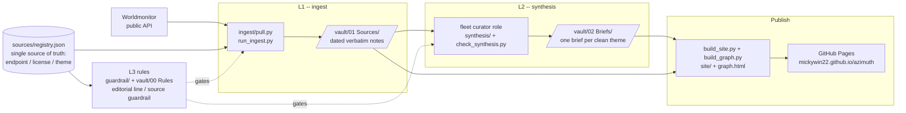

# azimuth — Architecture

> **Status:** Living (kept in step with the shipped engine)
> **Last updated:** 2026-07-01

azimuth is a public demonstrator of the HemySphere **L1 sources → L2 synthesis → L3 rules**
vault doctrine. It has **no web-server runtime, no database, and no frontend framework**: the
whole engine is a set of pure-stdlib Python CLIs (see [cli.md](cli.md)) that read and write a
plain-Markdown vault, plus GitHub Actions that run them on a schedule and publish the result as
a static site. This page maps how those pieces fit together. For *what* it is and *why*, read
[spec.md](spec.md); for the phased build order, [plan.md](plan.md).

## System overview

Data flows one way — open source data in, published briefs out — with the L3 rule set gating
both ends:

## The three layers

| Layer | Owns | Lives in | Written by |
|-------|------|----------|-----------|
| **L1 — Sources** | Dated, verbatim source notes — one per surfaced Worldmonitor subset per day | `vault/01 Sources/YYYY-MM-DD/` | `ingest/pull.py` (autonomous) |
| **L2 — Synthesis** | One evolving brief per editorially-clean theme, cited back to L1 | `vault/02 Briefs/` | the weekly fleet **curator** role (LLM job) |
| **L3 — Rules** | The editorial line, per-source license/attribution guardrail, and what may be surfaced at all | `vault/00 Rules/` + `guardrail/` | maintainers (enforced in CI) |

The layer split is the whole point of the demonstrator: raw data (L1) is never edited, claims
(L2) always rest on cited L1 notes, and the rules (L3) are machine-enforced rather than trusted.

## Single source of truth

There is deliberately **one** registry — [`sources/registry.json`](../sources/registry.json).
Every surfaced subset's endpoint, `license`, `attribution`, and `theme` is defined there once.
Ingest reads it, the [source guardrail](source-guardrail.md) enforces it, and the brief-index +
themes derive from it. To add or change a source you edit one JSON entry; ingest, the guardrail,
and the synthesis theme map all follow. Ingest can never surface what the guardrail would block —
a surfaced-but-non-compliant source produces no L1 note, for the same reason CI would fail.

## Runtime & dependencies

- **Runtime:** pure Python standard library — no third-party runtime deps, no server process.
- **Dev tooling** (`.[dev]`): ruff, mypy, pytest — install once with `uv pip install -e ".[dev]"`.
- **Site extra** (`.[site]`): the Markdown renderer used only by the static-site build job.
- **Everything runs from the repo root** as a plain CLI; there is nothing to keep "up".

## How it keeps running (operations)

Because there is no always-on server, "operating" means the scheduled jobs keep firing and their
liveness is visible. Five GitHub Actions workflows carry that (full table: [docs/README.md](README.md#continuous-integration--gates)):

| Workflow | Cadence | Role |
|----------|---------|------|
| `ingest.yml` | daily | Pulls the L1 subsets; asserts the newest L1 day is fresh, else opens an `ingest-alarm` issue |
| `synthesis-freshness.yml` | weekly (Mon) | Watches the L2 lane; opens a `synthesis-alarm` issue only if a brief is genuinely overdue |
| `ci.yml` | every push / PR | lint · format · type-check · guardrail · synthesis-lint · doc-link resolve · tests + coverage |
| `pages.yml` | push to `main` | Builds and publishes the static site to GitHub Pages |
| `secret-scan.yml` | every push / PR | Full-history secret + private-leakage scan — the C1 public-flip gate (red by design pre-flip) |

The L1 lane is fully autonomous GitHub infra; the L2 brief is written by an off-GitHub LLM
curator, so it gets its own weekly heartbeat rather than relying on a process that a power-off
could silently stop.

## Publish path

`build_site.py` renders the vault (L2 briefs → their L1 sources → the L3 editorial line) into a
static `site/`, and `build_graph.py` emits the `graph.json` / `graph.html` knowledge graph that
reaches down to the L1 sources, not just the briefs. `pages.yml` publishes it to **GitHub
Pages** at <https://mickywin22.github.io/azimuth/> (see [deploy.md](deploy.md)). There is no API
surface, no database, and no CORS/rate-limit concern — the site is read-only static files.

## Security posture

- **No secrets at runtime** — no server, no API keys in the request path.
- **Full-history secret + private-leakage scan** (`secret-scan.yml`) gates the public flip.
- **Vulnerability reporting:** see [SECURITY.md](../SECURITY.md).

For the public-flip go/no-go checklist, see
[security/public-flip-readiness.md](security/public-flip-readiness.md).
