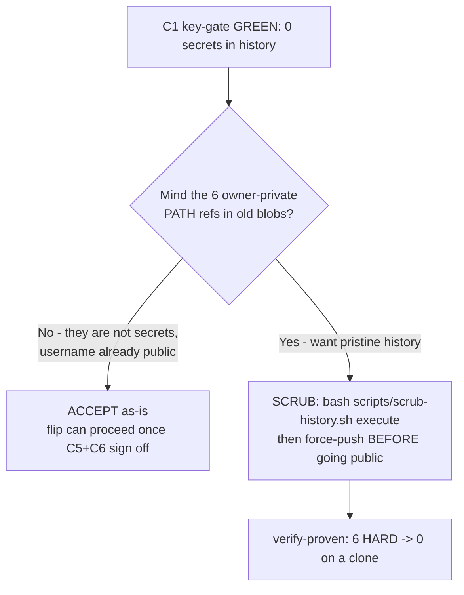

# C1c — Owner-Private History: the Accept-vs-Scrub Decision (Michael go-gate)

> **What this is.** The single 2-minute decision surface for **C1c**, the last
> privacy condition on the [Azimuth public-flip readiness](public-flip-readiness.md)
> checklist that is owned by **Michael**, not the fleet. Everything fleet-actionable
> is already GREEN. This page quantifies exactly what owner-private context survives
> in git **history** (gone from the working tree), explains why none of it is a
> credential, and gives you a clean **accept** or **scrub** call with both buttons
> proven-ready.

_Generated 2026-06-30 (fleet, Azimuth KR-A) from the live object DB — re-run
`python scripts/scan_private_leakage.py --history --json` to refresh._

## The one thing that matters first

**The KEY gate (C1) is GREEN.** `scripts/scan_secrets.py` over the full object DB
(**623 blobs + 244 working-tree files**) finds **0 secrets** — no API key, token,
private key, webhook, or credentialed DB URL anywhere in history. The public-flip
stop-condition *"no leaked keys in history before the repo goes public"* is **met**.

C1c is a **different, softer** question: not *"is there a key?"* (there isn't) but
*"do we mind that some old commits mention this machine's local paths and internal
ticket numbers?"* That is a presentation/hygiene call, and it is yours.

## What is actually in history (and nowhere in HEAD)

The private-leakage history scan flags **6 HARD + 95 advisory** findings across
**623 blobs**. Every flagged path is **already removed from the working tree** (or
gitignored) — these live only in old commits.

### HARD findings — owner-private *paths* (6, the accept-vs-scrub call)

| # | What | Where (history-only) | What it reveals |
|---|------|----------------------|-----------------|
| ×3 | `.claude/settings.local.json` local hook paths (lean-ctx / a `package-*.ps1`) | blob `9567de8b6a` | this box's local Claude tooling config — **gitignored now**, absent from HEAD |
| ×2 | `C:\Users\Michael\…` absolute path | old `docs/security/secret-scan-2026-06-30.md` + `gitleaks-2026-06-24.md` blobs (those dated reports were folded into `public-flip-readiness.md`; the live copies are clean) | the OS username `Michael` |
| ×1 | `/HemySphere/` vault path | old `docs/coolify-deploy.md` blob | the private vault is named "HemySphere" |

**None are credentials.** The username `Michael` is *already public* — it is in the
repo `LICENSE` copyright line and the `mickywin22` GitHub handle. `/HemySphere/` and a
lean-ctx hook path expose only that a local second-brain + tooling exist, not how to
access anything.

### Advisory findings — internal process refs (95, cosmetic)

- **83 × `internal-iq-ref`** — HemySphere Input-Queue ticket numbers cited as
  build provenance: IQ #256, #312, #371, #429, #435, #490, #851, #887, #888, #898,
  #915, #937. They appear in `README.md`, `docs/spec.md`, `docs/plan.md`, `LICENSE`,
  `CREDITS.md`, `sources/registry.json`, `synthesis/azimuth-curator.md`, etc.
- **12 × `internal-sprint-audit-marker`** — `Strategic Architect` / sprint markers.

These expose only that a private ticketing system exists. They do **not** HARD-block
and are arguably an honest "build-in-public" provenance trail.

## Your decision



### Option A — **ACCEPT** (recommended)

Treat the 6 path refs as acceptable. Rationale: zero credentials, the username is
already public via the LICENSE, the paths are gone from HEAD, and a history rewrite
is destructive (every commit SHA changes, the existing remote + any clone/fork is
invalidated, the `docs/proof/` provenance chain is broken) for **no security gain**.
The post-flip CI gate (`secret-scan.yml`) keeps the *working tree* clean forever.

Nothing else to do — C1c is dispositioned; the flip waits only on C5 (#888) + C6 (#937).

### Option B — **SCRUB** (if you want pristine history)

A one-command, proven-ready destructive rewrite:

```bash
cd ~/Projects/azimuth
bash scripts/scrub-history.sh verify     # non-destructive: clones, strips, asserts 0 HARD
bash scripts/scrub-history.sh execute    # rewrites THIS repo in place (backup branch + tag; NO push)
# inspect, then BEFORE making public:
git push origin --force --all && git push origin --force --tags
```

`scripts/scrub-history.sh` purges all four now-removed paths (`.claude/`, the two old
security reports, `docs/coolify-deploy.md`) from every commit. The verify-mode proof is
recorded below.

> **Scrub-button verification (live, 2026-06-30, 623-blob object DB): VERIFY PASS.**
> `bash scripts/scrub-history.sh verify` cloned the current repo, ran the strip, and
> measured **HARD findings 6 → 0** with the **secret scan staying CLEAN** (exit 0).
> The scrub button works on today's history — ready for `execute` + force-push.

> The advisory IQ refs are **not** removed by the scrub (they are inside public-facing
> docs, not in removable files). To also neutralize those, the posture is `--strict`:
> `python scripts/scan_private_leakage.py --worktree --strict` lists them to replace
> with neutral phrasing. Most build-in-public projects keep them.

---
*Owned by the Azimuth public-flip gate (KR-A). Companion to
[`public-flip-readiness.md`](public-flip-readiness.md) (the full go/no-go table) and
`scripts/scrub-history.sh` (the scrub button). C1c never blocks the fleet runner —
`scripts/check_flip_readiness.py` exits 0 with all fleet gates GREEN.*
