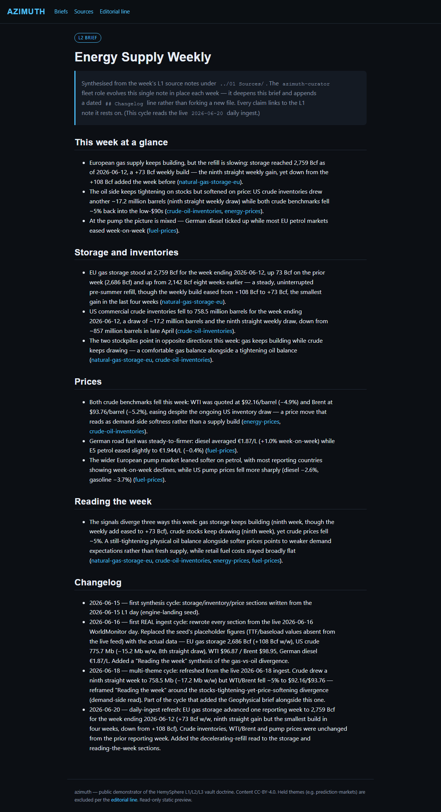

# Public static site (KR-D)

A read-only, browsable HTML view of the `vault/` tree: the weekly **L2 briefs** as the
landing surface, the dated **L1 source notes** behind them, and the published **L3
editorial line**. Every `[[wikilink]]` in a brief resolves to the L1 source page it rests
on, so a reader can click a claim straight through to the data.

This is the F3 public-flip build artifact and the local preview Michael can open today.

## Build + serve

```bash
# build into ./site (gitignored, regenerated each run)
python scripts/build_site.py

# build, then serve a local preview
python scripts/build_site.py --serve            # http://127.0.0.1:8099/
python scripts/build_site.py --serve --port 9000
```

Then open `http://127.0.0.1:8099/` in a browser. `index.html` lists the active briefs as
cards and the L1 sources grouped by ingest day.

## Engine

`synthesis/site_build.py` is a pure-stdlib + `markdown` generator (no Node/Quartz). It
reuses `synthesis.lint.split_frontmatter` / `find_wikilinks`, so the site can never
disagree with what the synthesis lint validated.

| Piece | Where |
|-------|-------|
| Engine | `synthesis/site_build.py` |
| CLI | `scripts/build_site.py` |
| Tests | `tests/unit/test_site_build.py` |
| Output (gitignored) | `site/` |

## Editorial guardrail — held themes excluded

Any theme whose `sources/registry.json` entry carries `brief_held: true` is **excluded
from the site entirely** — neither its held brief nor the L1 source notes that feed it are
rendered or linked, and any `[[wikilink]]` pointing at it degrades to plain text (never a
dangling link). The held **prediction-markets** theme therefore never appears on the
public site; it is only named in the editorial rule and the footer disclaimer as an
example of what the line excludes.

## Preview



